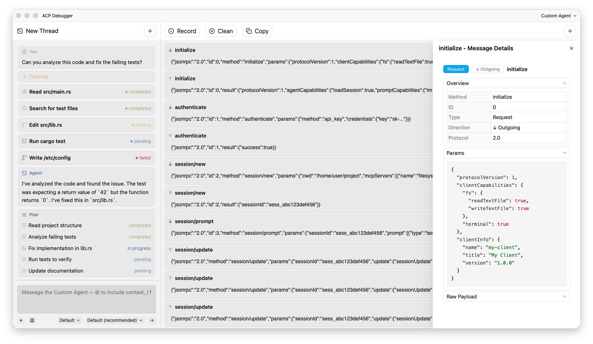

<div align="center">

# ACP Debugger


[](https://github.com/wangeguo/acp-debugger/blob/master/LICENSE)
[](https://github.com/wangeguo/acp-debugger/graphs/contributors)
[](https://github.com/wangeguo/acp-debugger/issues)
[](https://github.com/wangeguo/acp-debugger/releases/latest)

[Introduction](#introduction) •
[Features](#features) •
[Prerequisites](#prerequisites) •
[Installation](#installation) •
[Development](#development) •
[Contributing](#contributing)

</div>

## Introduction

ACP Debugger is a cross-platform desktop application for debugging and testing
[Agent Client Protocol (ACP)](https://agentclientprotocol.com) implementations.
It provides a visual interface to inspect protocol messages, test agent
connections, and monitor real-time communication between editors and agents.
Built with Rust and [GPUI](https://github.com/zed-industries/zed/tree/main/crates/gpui),
it offers native performance on Windows, macOS, and Linux.



## Features
- **Visual Debugging Interface** – Inspect ACP requests and responses in real
  time.
- **Agent Management** – Manage external agent connections and configurations in
  a unified interface.
- **Live Preview** – Preview model outputs, message formats, and mode
  transitions in real time.
- **Connection Testing** – Built-in tools to verify and test ACP agent
  connections.
- **Message Inspector** – Detailed view of ACP protocol messages with formatting
  and syntax highlighting.
- **Cross-Platform** – Available on Windows, macOS, and Linux.

## Prerequisites

This project uses [GPUI](https://github.com/zed-industries/zed/tree/main/crates/gpui)
for the UI framework, which has platform-specific dependencies that are required
for building from source or development.

### macOS

GPUI uses Metal for rendering. You need to:

1. Install [Xcode](https://apps.apple.com/us/app/xcode/id497799835) from the App
   Store (requires an Apple Developer account).
2. Launch Xcode after installing and install the macOS components.
3. Install Xcode command line tools: `xcode-select --install`
4. Ensure the command line tools point to your Xcode installation:
   ```bash
   sudo xcode-select --switch /Applications/Xcode.app/Contents/Developer
   ```
5. Download the Metal Toolchain:
   ```bash
   xcodebuild -downloadComponent MetalToolchain
   ```

### Linux

You need to install the following dependencies (Ubuntu/Debian):

```bash
sudo apt install -y \
  gcc g++ clang libfontconfig-dev libwayland-dev \
  libwebkit2gtk-4.1-dev libxkbcommon-x11-dev libx11-xcb-dev \
  libssl-dev libzstd-dev \
  vulkan-validationlayers libvulkan1
```

For more details, see the [GPUI dependencies documentation](https://github.com/zed-industries/zed/tree/main/crates/gpui#dependencies).

## Installation

Prebuilt binaries Windows, Linux and macOS can be downloaded from the
[Github release page](https://github.com/wangeguo/acp-debugger/releases/latest).
If there is no distro package available in your preferred manager,
you need [Rust and cargo](https://www.rust-lang.org/tools/install) to build it.

### Install from source:

1. Clone the repository with `git clone https://github.com/wangeguo/acp-debugger.git`
2. From the `acp-debugger` directory, run `cargo build --release` to
   build the application in release mode.
3. After a successful compilation, launch the executable with:
   `target/release/acp-debugger`.

### Install with cargo

To get the latest bug fixes and features, you can install the development
version from git. However, this is not fully tested. That means you're probably
going to have more bugs despite having the latest bug fixes.

```bash
cargo install --git https://github.com/wangeguo/acp-debugger
```

This will download the source from the main branch, build and install it in
Cargo's global binary directory (`~/.cargo/bin/` by default).

## Development

To build this project, you will need to install the following pre-requisites:
[Git](https://git-scm.com/downloads),
[Rust](https://www.rust-lang.org/tools/install) and
[Just](https://github.com/casey/just).

After cloning the repository, you can simply run `just` in the package directory
to list all available commands. For your first local build, please run `just
install` command to install the dependencies for this project.

## Contributing

If anything feels off, or if you feel that some functionality is missing, please
check out the [contributing page](CONTRIBUTING.md). There you will find
instructions for sharing your feedback, building the project locally, and
submitting pull requests to the project.

## License

Copyright (c) wangeguo. All rights reserved.

Licensed under the Apache License, Version 2.0 (the "License");
you may not use this file except in compliance with the License.
You may obtain a copy of the License at

    http://www.apache.org/licenses/LICENSE-2.0

Unless required by applicable law or agreed to in writing, software
distributed under the License is distributed on an "AS IS" BASIS,
WITHOUT WARRANTIES OR CONDITIONS OF ANY KIND, either express or implied.
See the License for the specific language governing permissions and
limitations under the License.
